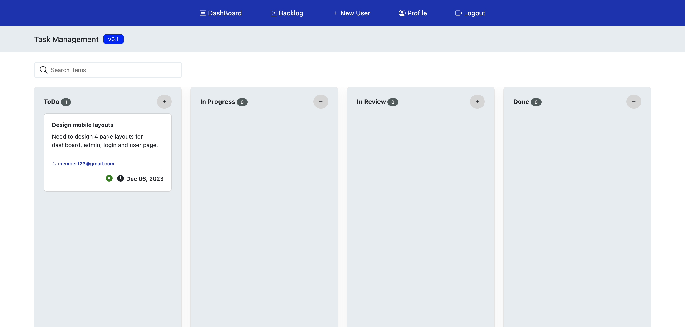
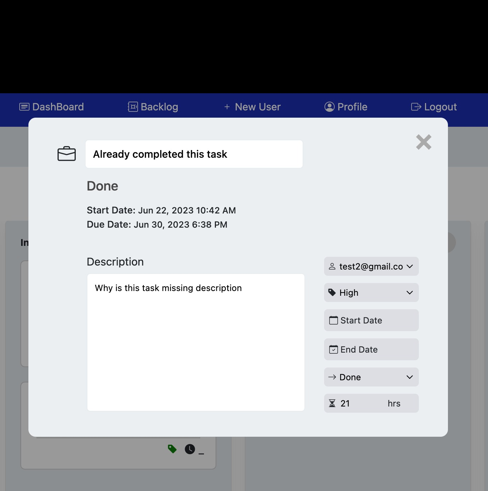
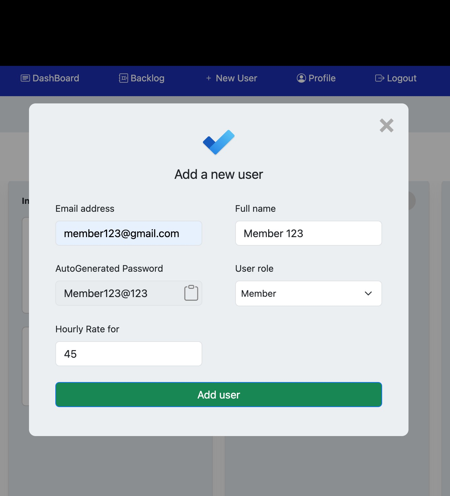

## Name

TaskMan - A task management web app.

#### <a target="_blank" href="task-man.surge.sh/">task-man.surge.sh/</a>


## Description

TaskMan is a powerful and intuitive web application built using JavaScript, HTML, and CSS, designed to help you stay organized and productive. With its user-friendly interface and seamless functionality, TaskMan revolutionizes the way you manage your tasks and projects.

## Technologies

- JavaScript
- HTML
- CSS
- LocalStorage
- BootStrap
- Day.js

## Credits
Design taken from figma

Link - https://www.figma.com/community/file/995666043585336668/Task-Management-App

Thanks to https://www.figma.com/@SanderVreeken

## Usage

The app seeds default one of each admin, member and task, using the file `/helpers/seed.js`.

```js
admin login credentials

email:    admin123@gmail.com
password: Admin@123


member login credentials

email:    member123@gmail.com
password: Member@123
```
## Snapshots









